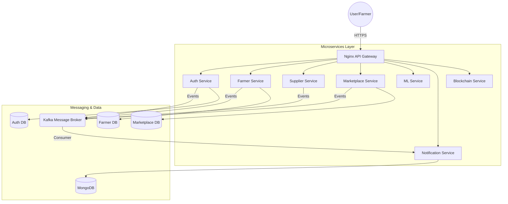

# 🌾 AgriLink V2 — Agricultural Intelligence & E-commerce Platform

AgriLink V2 is a production-grade, microservices-based platform designed to revolutionize the agricultural ecosystem in India. It leverages AI for land verification, Blockchain for transparent agreements, and an integrated Marketplace for direct farmer-supplier interaction.

---

## 🚀 Quick Start Guide

### 1. Clone the Repository
```bash
git clone https://github.com/your-username/AgriLink_v2.git
cd AgriLink_v2
```

### 2. Environment Configuration
Create a `.env` file in the root directory and populate it with the required secrets (refer to `.env.example` if available).
```bash
cp .env.example .env
# Open .env and fill in your Cloudinary, Gemini, and Database credentials.
```

### 3. Initialize Databases & Prisma
Each service manages its own schema. Generate the Prisma clients for all services:
```bash
# In the root directory
npx prisma generate --schema=services/auth/prisma/schema.prisma
npx prisma generate --schema=services/farmer/prisma/schema.prisma
npx prisma generate --schema=services/supplier/prisma/schema.prisma
npx prisma generate --schema=services/marketplace/prisma/schema.prisma
```

### 4. Setup Local Blockchain (Hardhat)
AgriLink uses smart contracts for land agreements.
```bash
cd services/blockchain
npm install
npx hardhat node # Starts a local Ethereum-compatible node on port 8545
```
In a separate terminal, deploy the contracts:
```bash
npx hardhat run scripts/deploy.ts --network localhost
```

### 5. Launch Infrastructure (Docker)
AgriLink requires Kafka, Redis, and MongoDB to function.
```bash
docker-compose up -d
```
This will start:
- **Nginx Gateway**: Port 8080 (Central entry point)
- **Kafka / Zookeeper**: For event-driven sync
- **Redis**: For OTP and caching
- **MongoDB**: For notification logs

### 6. Run Microservices (Development Mode)
Open separate terminals for each service and run:
```bash
# Auth Service
cd services/auth && npm run dev

# Farmer Service
cd services/farmer && npm run dev

# Marketplace Service
cd services/marketplace && npm run dev

# Notification Service
cd services/notification && npm run dev

# ML Service (Python)
cd services/ml_service
source venv/bin/activate
uvicorn main:app --port 4006 --reload
```

### 7. Launch the Web Application
```bash
cd apps/web
npm run dev
```
Access the platform at: **[http://localhost:3000](http://localhost:3000)**

---

## 🛠️ System Architecture

AgriLink V2 follows a **Decoupled, Event-Driven Microservices Architecture** designed for high availability and modularity.

### 🏗️ High-Level Overview


### 📡 Service Breakdown
- **Nginx API Gateway (Port 8080)**: The single entry point. Handles rate limiting, SSL termination, and transparently routes traffic to the internal microservices.
- **Auth Service (4001)**: The identity provider. Manages JWT issuance (Access/Refresh tokens), Role-Based Access Control (RBAC), and global audit logging.
- **Farmer Service (4002)**: Handles the "Trust Engine." Processes KYC, RTC land records, and hand-drawn land sketches using intelligent name-matching confidence scores.
- **Supplier Service (4003)**: Manages supplier catalogs, trade licenses, and inventory verification.
- **Marketplace Service (4004)**: Core e-commerce engine. Manages the product catalog, shopping carts, wishlists, and Razorpay payment integration.
- **Notification Service (4005)**: The communication hub. Consumes Kafka events to dispatch real-time WebSocket alerts, SMS (Fast2SMS), and Email (SMTP).
- **ML Service (4006)**: A specialized Python (FastAPI) service. Leverages Google Vision and Gemini Pro for document OCR and intelligent extraction of land details.
- **Blockchain Service (4007)**: Interacts with the Polygon Amoy testnet to store immutable land agreement hashes for legal transparency.

### 🔄 Event-Driven Flow (Kafka)
AgriLink uses Kafka to ensure eventual consistency across services without hard-coupling.
- **User Registration**: `Auth` publishes `user.registered` → `Farmer`/`Supplier` create local profile stubs.
- **KYC Decision**: `Farmer` publishes `kyc.approved` → `Auth` promotes user role → `Notif` sends a celebratory alert.
- **Order Placement**: `Marketplace` publishes `order.placed` → `Supplier` receives a dashboard alert → `Notif` sends an order confirmation SMS.

---

## 🛡️ Administrative Hub
AgriLink includes a premium **Admin Dashboard** for platform governance.
- **KYC Queue**: Review and approve farmer/supplier identities.
- **Audit Logs**: Visual timeline of all critical system actions.
- **Promotion**: Use the CLI tool to promote users:
  ```bash
  npm run admin:promote <email>
  ```

---

## 📦 Tech Stack
- **Frontend**: Next.js 14, Tailwind CSS, SWR, Lucide.
- **Backend**: Fastify (Node.js), FastAPI (Python), Prisma ORM.
- **Data**: PostgreSQL, MongoDB, Redis.
- **Messaging**: Apache Kafka.
- **AI**: Google Gemini Pro, Cloud Vision.
- **Blockchain**: Solidity, Viem, Hardhat.

---

## 📄 License
This project is licensed under the MIT License.

---
**Built for Indian Agriculture.**
